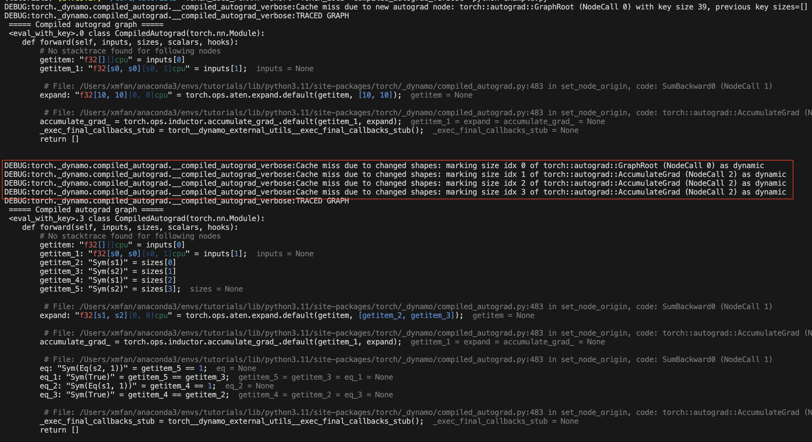

Compiled Autograd: 为 ``torch.compile`` 捕获更大的后向图
==========================================================================
**作者:** `Simon Fan <https://github.com/xmfan>`_

.. grid:: 2

    .. grid-item-card:: :octicon:`mortar-board;1em;` What you will learn
       :class-card: card-prerequisites

       * How compiled autograd interacts with ``torch.compile``
       * How to use the compiled autograd API
       * How to inspect logs using ``TORCH_LOGS``
       * 编译自动微分如何与 ``torch.compile`` 交互
       * 如何使用编译自动微分API
       * 如何使用 ``TORCH_LOGS`` 检查日志

    .. grid-item-card:: :octicon:`list-unordered;1em;` Prerequisites
       :class-card: card-prerequisites

       * PyTorch 2.4
       * 完成 `torch.compile介绍` <https://pytorch.org/tutorials/intermediate/torch_compile_tutorial.html>`_
       * 阅读 `开始使用PyTorch 2.x <https://pytorch.org/get-started/pytorch-2.0/>`_ 中的TorchDynamo和AOTAutograd部分

概览
--------
编译自动微分是 PyTorch 2.4 中引入的 ``torch.compile`` 扩展，它允许捕获更大的后向图。

虽然 ``torch.compile`` 确实会捕获后向图，但它是 **部分** 捕获的。AOTAutograd 组件提前捕获后向图，但存在一些限制：

* 前向中的图断裂导致后向中的图断裂
* `后向钩子 <https://pytorch.org/docs/stable/notes/autograd.html#backward-hooks-execution>`_ 没有被捕获

编译自动微分通过直接与自动微分引擎集成，允许在运行时捕获完整的后向图。具有以下两个特征的模型应该尝试使用编译自动微分，并可能观察到更好的性能。

然而，编译自动微分也有对应的限制：

* 在后向开始时增加了运行时开销，用于缓存查找
* 在动态中更容易重新编译和图断裂，因为捕获的范围更大

.. 注意:: 编译自动微分正在积极开发中，尚未与所有现有的PyTorch功能兼容。有关特定功能的最新消息，请参阅 `编译自动微分登录页面 <https://docs.google.com/document/d/11VucFBEewzqgkABIjebZIzMvrXr3BtcY1aGKpX61pJY>`_。

设置
-----
在本教程中，我们将基于这个简单的神经网络模型进行示例。
它接受一个10维输入向量，通过单个线性层处理它，并输出另一个10维向量。

.. code:: python

   import torch

   class Model(torch.nn.Module):
      def __init__(self):
         super().__init__()
         self.linear = torch.nn.Linear(10, 10)

      def forward(self, x):
         return self.linear(x)

基本用法
------------
在调用 ``torch.compile`` API之前，请确保将 ``torch._dynamo.config.compiled_autograd`` 设置为 ``True``：

.. code:: python

   model = Model()
   x = torch.randn(10)

   torch._dynamo.config.compiled_autograd = True
   @torch.compile
   def train(model, x):
      loss = model(x).sum()
      loss.backward()

   train(model, x) 

在上述代码中，我们创建了 ``Model`` 类的实例，并使用 ``torch.randn(10)`` 生成了一个随机的10维张量 ``x``。
我们定义了训练循环函数 ``train``，并用 @torch.compile 装饰它以优化其执行。
当调用 ``train(model, x)`` 时：

* Python解释器调用Dynamo，因为此调用被装饰有 ``@torch.compile``。
* Dynamo拦截Python字节码，模拟它们的执行并将操作记录到图中。
* ``AOTDispatcher`` 禁用钩子并调用自动微分引擎为 ``model.linear.weight`` 和 ``model.linear.bias`` 计算梯度，并将操作记录到图中。使用 ``torch.autograd.Function``，AOTDispatcher重写 ``train`` 的前向和后向实现。
* Inductor生成一个对应于AOTDispatcher前向和后向的优化实现的函数。
* Dynamo将优化后的函数设置为Python解释器下一次执行。
* Python解释器执行优化后的函数，执行 ``loss = model(x).sum()``.
* Python解释器执行 ``loss.backward()`` ,调用自动微分引擎，因为我们设置了 ``torch._dynamo.config.compiled_autograd = True``，所以路由到编译自动微分引擎。
* 编译自动微分计算 ``model.linear.weight`` 和 ``model.linear.bias`` 的梯度，并将操作记录到图中，包括它遇到的任何钩子。在此过程中，它将记录AOTDispatcher之前重写的后向。然后编译自动微分生成一个新的函数，对应于 ``loss.backward()`` 的完全跟踪实现，并在 ``torch.compile`` 的推理模式下执行它。
* 相同的步骤递归地适用于编译自动微分图，但这一次AOTDispatcher将不需要划分图。

检查编译自动微分日志
-------------------------------------
使用 ``TORCH_LOGS`` 环境变量运行脚本：

* 仅打印编译自动微分图，使用 ``TORCH_LOGS="compiled_autograd" python example.py``
* 以性能为代价打印带有更多张量元数据和重新编译原因的图，使用 ``TORCH_LOGS="compiled_autograd_verbose" python example.py``

重新运行上述代码片段，编译自动微分图现在应该被记录到 ``stderr``。某些图节点的名称将有 ``aot0_`` 的前缀，
这些对应于AOTAutograd后向图0中预先编译的节点，例如， ``aot0_view_2`` 对应于ID为0的AOT后向图中的view_2。

下图中，红色框包含了 ``torch.compile`` 在没有编译自动微分的情况下捕获的AOT后向图。

.. 注意:: 这是我们将调用 ``torch.compile`` 的图，不是优化后的图。编译自动微分本质上生成一些未优化的Python代码来表示整个C++自动微分执行。

使用不同的标志编译前向和后向传递
-------------------------------------------------------------
你可以为两次编译使用不同的编译器配置，例如，即使前向存在图断裂，后向可能是全图。

.. code:: python

   def train(model, x):
       model = torch.compile(model)
       loss = model(x).sum()
       torch._dynamo.config.compiled_autograd = True
       torch.compile(lambda: loss.backward(), fullgraph=True)()

或者你可以使用上下文管理器，它将适用于其作用域内的所有自动微分调用。

.. code:: python

   def train(model, x):
      model = torch.compile(model)
      loss = model(x).sum()
      with torch._dynamo.compiled_autograd.enable(torch.compile(fullgraph=True)):
         loss.backward()

编译自动微分解决了AOTAutograd的某些限制
--------------------------------------------------------------
1. 前向传递中的图断裂不再必然导致后向传递中的图断裂：

.. code:: python

   @torch.compile(backend="aot_eager")
   def fn(x):
      # 1st graph
      temp = x + 10
      torch._dynamo.graph_break()
      # 2nd graph
      temp = temp + 10
      torch._dynamo.graph_break()
      # 3rd graph
      return temp.sum()

   x = torch.randn(10, 10, requires_grad=True)
   torch._dynamo.utils.counters.clear()
   loss = fn(x)

   # 1. base torch.compile 
   loss.backward(retain_graph=True)
   assert(torch._dynamo.utils.counters["stats"]["unique_graphs"] == 3)
   torch._dynamo.utils.counters.clear()

   # 2. torch.compile with compiled autograd
   with torch._dynamo.compiled_autograd.enable(torch.compile(backend="aot_eager")):
      loss.backward()

   # single graph for the backward
   assert(torch._dynamo.utils.counters["stats"]["unique_graphs"] == 1)

在第一个 ``torch.compile`` 案例中，我们可以看到由于编译函数 ``fn`` 中的两个图断裂，产生了3个后向图。
而在第二个带有编译自动微分的 ``torch.compile`` 案例中，尽管存在图断裂，我们看到了整个后向图被跟踪。

.. 注意:: Dynamo在跟踪编译自动微分捕获的后向钩子时，仍然可能发生图断裂。

2. 现在可以捕获后向钩子

.. code:: python

   @torch.compile(backend="aot_eager")
   def fn(x):
      return x.sum()

   x = torch.randn(10, 10, requires_grad=True)
   x.register_hook(lambda grad: grad+10)
   loss = fn(x)

   with torch._dynamo.compiled_autograd.enable(torch.compile(backend="aot_eager")):
      loss.backward()

图中应该有一个 ``call_hook`` 节点，dynamo稍后将其内联到以下内容：

.. image:: ../_static/img/compiled_autograd/call_hook_node.png

编译自动微分的常见重新编译原因
--------------------------------------------------
1. 由于损失值的自动微分结构发生变化：

.. code:: python

   torch._dynamo.config.compiled_autograd = True
   x = torch.randn(10, requires_grad=True)
   for op in [torch.add, torch.sub, torch.mul, torch.div]:
      loss = op(x, x).sum()
      torch.compile(lambda: loss.backward(), backend="eager")()

在上面的例子中，我们在每次迭代中调用不同的操作符，导致 ``loss`` 每次都跟踪不同的自动微分历史。你应该看到一些重新编译消息： **由于新的自动微分节点导致的缓存未命中**。

.. image:: ../_static/img/compiled_autograd/recompile_due_to_node.png

2. 由于张量形状变化:

.. code:: python

   torch._dynamo.config.compiled_autograd = True
   for i in [10, 100, 10]:
      x = torch.randn(i, i, requires_grad=True)
      loss = x.sum()
      torch.compile(lambda: loss.backward(), backend="eager")()

在上面的例子中， ``x`` 改变了形状，编译自动微分在第一次变化后将x标记为动态形状张量。你应该看到重新编译消息： **由于形状变化导致的缓存未命中**。

结论
----------
在本教程中，我们介绍了 ``torch.compile`` 与编译自动微分的高级生态系统，编译自动微分的基础知识以及一些常见的重新编译原因。请继续关注 `dev-discuss <https://dev-discuss.pytorch.org/>`_ 上的深入探讨。